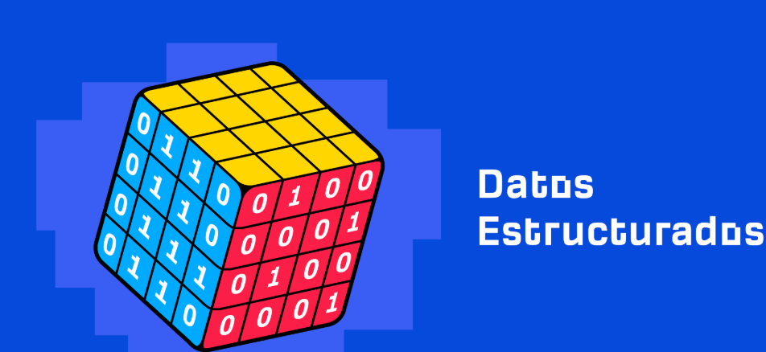

# Estructura de datos 

En este `repositorio`podras encontrar temas relacionados con `estructuras de datos` implementadas en **JAVA** como: 

1. Tipos de Datos Abstractos
2. Recursividad 
3. Arreglos 
4. Genéricos
5. Listas 
6. Pilas
7. Colas 
8. Métodos de Ordenamiento y Búsqueda
9. Arboles 

